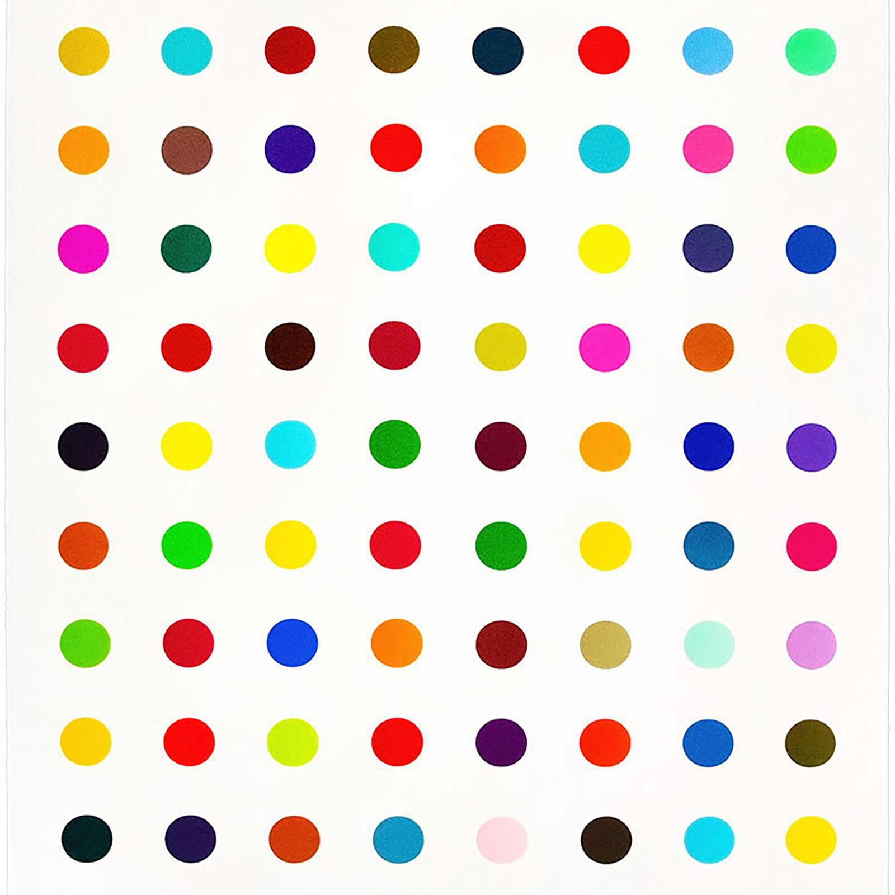

# Damien Hirst Painting using Python

Using Python to recreate a Damien Hirst spot painting on a Black screen with colors drawn from an external image.

### Requirements
[Colorgram](https://pypi.org/project/colorgram.py/)

[Turtle](https://docs.python.org/3/library/turtle.html)

To install Colorgram:

```sh
pip install colorgram.py
```

### Source Image for Obtaining Colors:


